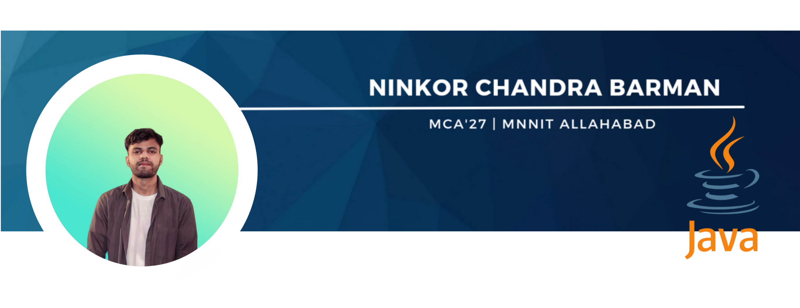

<h1 align="center">🌟 Welcome to My GitHub Profile! 🌟</h1>

<h2 align="center">Hi 👋, I'm an MCA student at NIT Allahabad, passionate about mastering Java Full Stack development.</h2>

---

---

### 📊 GitHub Stats

  
  
  

---

<h2>💻 Tech Stack</h2>

  
  
  
  
  
  
  
  
  
  
  
  
  
  
  

---

<h2>🌐 Connect with Me</h2>

  

  

---

<h2>🏆 Achievements</h2>

  

---

<h2>🐍 GitHub Activity</h2>

  <picture>
    <source media="(prefers-color-scheme: dark)" srcset="https://raw.githubusercontent.com/NinkorB/NinkorB/output/github-snake-dark.svg" />
    <source media="(prefers-color-scheme: light)" srcset="https://raw.githubusercontent.com/NinkorB/NinkorB/output/github-snake.svg" />
    
  </picture>

---

<h2>🔥 Streaks</h2>

  

---

  <h3>💡 "Keep learning, keep growing, and never stop exploring!"</h3>

